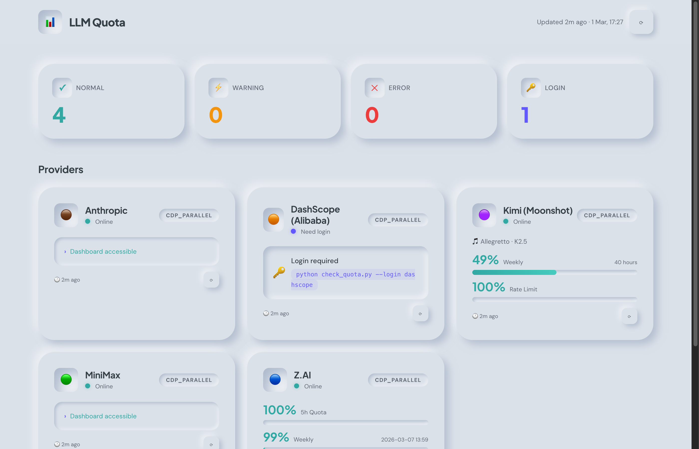

# LLM Quota Dashboard

Neumorphic dashboard for tracking LLM coding plan quotas — browser-scrape first, API fallback.

Developed with [OpenClaw](https://github.com/openclaw/openclaw) 🐾

📊 **Demo**: [GitHub Pages](https://joe2643.github.io/llm-quota-dashboard/) (static sample data)



---

## Quick Start

```bash
# Clone
git clone https://github.com/joe2643/llm-quota-dashboard.git
cd llm-quota-dashboard

# Install deps
pip install flask websocket-client

# Start Chrome with CDP (or use OpenClaw browser)
# chrome --remote-debugging-port=18800

# Start dashboard (auto-refreshes every 30min)
python3 web/server.py        # http://localhost:8502
```

The server automatically:
- Scrapes all providers in parallel every 30 minutes
- Starts headless Chrome if no CDP browser is detected
- Detects login issues per provider
- Serves a live-updating neumorphic UI

---

## Architecture

```
Chrome (your profile, logged in) → CDP WebSocket
  ↓
Parallel scraper (one tab per provider, background)
  ↓
data/quota_data.json
  ↓
Flask server → Neumorphic UI (auto-polls every 30s)
```

### Files

```
index.html                            # GitHub Pages entry (static demo)
web/
  index.html                          # Neumorphic frontend (vanilla HTML/CSS/JS)
  server.py                           # Flask backend + background scraper
scripts/
  scrape_dashboards_parallel.py       # Parallel CDP scraper (primary)
  scrape_dashboards.py                # Sequential CDP scraper (fallback)
  check_quota.py                      # Legacy Playwright scraper
data/
  providers.json                      # Provider configs (editable)
  quota_data.json                     # Latest quota data (auto-generated)
```

---

## Adding Providers

### Recommended: Use OpenClaw

The easiest way to add and configure providers is through [OpenClaw](https://github.com/openclaw/openclaw). Just tell your agent:

> "Add DeepSeek to my LLM quota dashboard"

OpenClaw will:
1. Add the provider config to `data/providers.json`
2. Write the scraper function in `scrape_dashboards_parallel.py`
3. Test it and fix any issues
4. Commit the changes

This is how the dashboard was built — each provider scraper was developed conversationally through OpenClaw.

### Manual: Edit providers.json + scraper

**Step 1**: Add to `data/providers.json`:
```json
{
  "my_provider": {
    "name": "My Provider",
    "dashboard_url": "https://example.com/dashboard",
    "color": "🔹",
    "enabled": true,
    "notes": "Any notes"
  }
}
```

**Step 2**: Add a scraper function in `scripts/scrape_dashboards_parallel.py`:
```python
def scrape_my_provider(tab: CDPTab) -> dict:
    tab.navigate("https://example.com/dashboard")
    # Wait for page data to load
    found, text = tab.wait_for_text(["some keyword"], timeout=15)

    data = {"provider": "my_provider"}
    # Parse with regex...
    m = re.search(r'(\d+)%\s*used', text)
    if m:
        data["current_used_pct"] = int(m.group(1))

    return {"status": "success", "method": "cdp_parallel",
            "data": data, "last_checked": now_iso()}
```

**Step 3**: Register in `PROVIDERS` dict:
```python
PROVIDERS = {
    ...
    "my_provider": {"name": "My Provider", "color": "🔹", "fn": scrape_my_provider},
}
```

The dashboard frontend automatically renders any `*_used_pct` field as a progress bar.

### Supported pct fields (auto-rendered as bars)

| Field | Label |
|---|---|
| `session_used_pct` | Session |
| `5h_quota_used_pct` / `5h_used_pct` | 5h Quota |
| `weekly_used_pct` / `weekly_quota_used_pct` | Weekly |
| `weekly_all_used_pct` | Weekly (all) |
| `monthly_used_pct` | Monthly |
| `monthly_search_used_pct` | Search |
| `rate_limit_used_pct` | Rate Limit |
| `current_used_pct` | Current |
| `extra_used_pct` | Extra |

---

## Supported Providers

| Provider | Method | Data Extracted |
|---|---|---|
| **Z.AI** | CDP | 5h/Weekly/Monthly quota %, total tokens |
| **DashScope** | CDP + hover popover | 5h/Weekly/Monthly usage, plan info |
| **Anthropic** | CDP | Session/Weekly/Extra usage %, spend, balance |
| **Kimi** | CDP | Weekly/Rate limit %, tier, model |
| **MiniMax** | CDP | Prompts per window, plan, validity |

---

## How the Scraper Works

1. Connects to Chrome via CDP WebSocket (`port 18800`)
2. Opens one background tab per provider (parallel, won't steal focus)
3. Navigates to dashboard, waits for data keywords
4. Extracts `document.body.innerText`, parses with regex
5. Detects login issues (redirect to login page → `need_login` status)
6. Closes tabs, saves to `quota_data.json`

**Login**: The scraper uses your existing Chrome sessions. Just be logged in to your providers in the Chrome instance running with `--remote-debugging-port`.

### Running manually

```bash
# All providers (parallel)
python3 scripts/scrape_dashboards_parallel.py

# Single provider with debug output
python3 scripts/scrape_dashboards_parallel.py -p kimi --debug

# Sequential fallback
python3 scripts/scrape_dashboards.py
```

---

## Dashboard UI

- **Design**: Neumorphism (Soft UI) — `#E0E5EC` base, dual shadows
- **Stack**: Flask + vanilla HTML/CSS/JS (no build step, no npm)
- **Auto-refresh**: Frontend polls every 30s, pauses when tab hidden
- **Per-card timestamps**: Shows when each provider was last checked
- **Login detection**: Shows 🔑 card when provider needs re-login

### Two modes

- **With Flask**: Live data from `/api/data`, refresh button triggers scraper
- **Static (GitHub Pages)**: Falls back to `data/quota_data.json`

---

## Deployment

### Local
```bash
python3 web/server.py    # http://localhost:8502
```

### Cloudflare Tunnel
```yaml
# ~/.cloudflared/config.yml
- service: http://localhost:8502
  hostname: dashboard.yourdomain.com
```

### GitHub Pages (Static Demo)
Enable GitHub Pages in repo settings (source: `master`, root `/`).

---

## License

MIT
